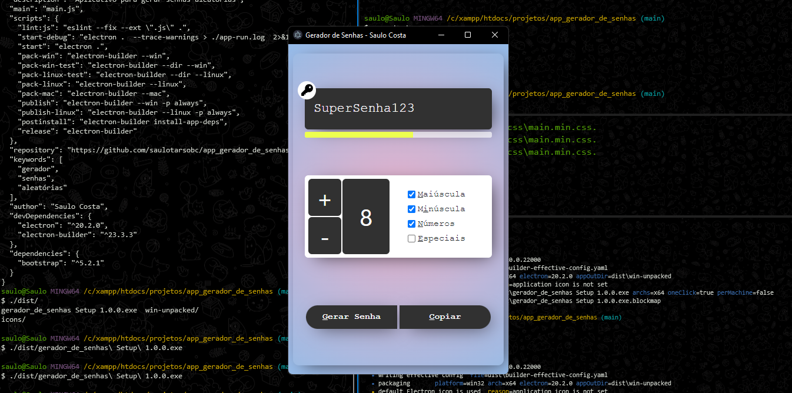

# SC - Password Gen

> A safe passworf generator

---

<div align="center">
  
  
</div>

<div align="center">
  
  
  
  
  
  
  
</div>

---

<!-- Badge Start -->
<div align="center">
 
 
 
 
 
 
</div>
<!-- Badge End -->

---



---

## Getting Started

```bash
# Clone this repository
$ git clone https://github.com/saulotarsobc/sc-password-gen
# Go into the repository
$ cd sc-password-gen
# Install dependencies
$ yarn install
# Run the app
$ yarn dev
```

---

## Available Scripts

- **dev**: Builds the Electron app and starts the development environment using the dev script.
- **vite:dev**: Starts the Vite development server.
- **vite:build**: Compiles TypeScript and builds the Vite application for production.
- **preview**: Previews the built Vite application.
- **electron:build**: Compiles TypeScript files in the electron directory.
- **build:all**: Runs both electron:build and vite:build to prepare the entire application.
- **postinstall**: Installs application dependencies using electron-builder.
- **update:readme**: Updates the readme file using a script.
- **dist**: Builds the application and packages it for distribution using electron-builder.

---

## References

- [Electron Builder](https://www.electron.build/)
- [ElectronJS with NextJS](https://github.com/saulotarsobc/electronjs-with-nextjs)
- [Electron](https://www.electronjs.org/)
- [Vite](https://vite.dev/)
- [Como criar um app Electron usando Vite](https://dev.to/rafaelberaldo/como-criar-um-app-electron-usando-vite-52d6) - [@rfberaldo](https://github.com/rfberaldo)
